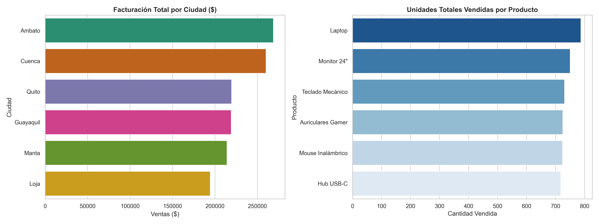

# 🚀 Análisis de Rendimiento y Limpieza de Datos - E-commerce (Python)

Este proyecto demuestra habilidades intermedias de **Data Cleaning (Limpieza de Datos)** y **Análisis Exploratorio de Datos (EDA)** utilizando Python para resolver un problema de negocio real de una tienda en línea con más de 1,500 registros de ventas.

## 📋 Problema de Negocio
La empresa de comercio electrónico presentaba inconsistencias en sus bases de datos temporales, registros con cantidades faltantes y formatos monetarios corruptos (strings con símbolos de moneda), lo que impedía calcular la facturación real y el rendimiento por ciudades o productos.

## 🛠️ Herramientas y Librerías Utilizadas
* **Python 3**
* **Pandas:** Para la ingesta de datos, manipulación de tipos, tratamiento de valores nulos y agregaciones de negocio.
* **Seaborn & Matplotlib:** Para la creación de la identidad visual y reportes gráficos ejecutivos.

## 🧹 Procesamiento y Limpieza de Datos Realizada
1. **Normalización Monetaria:** Conversión de la columna `Precio_Unitario` de formato texto (`$1200`) a tipo flotante numérico para permitir operaciones matemáticas.
2. **Tratamiento de Nulos:** Imputación lógica de cantidades vacías asignándoles el valor mínimo (`1`) según reglas de negocio, y remoción de filas huérfanas sin registros de fecha.
3. **Optimización Temporal:** Transformación de la columna cronológica a tipo `datetime` para asegurar la integridad de análisis futuros.
4. **Ingeniería de Características:** Creación de la métrica clave `Total_Ventas` ($Cantidad \times Precio$).

## 📈 Resultados Visuales del Análisis
A continuación se presenta el reporte ejecutivo automatizado que genera el script:

## 💡 Conclusiones del Analista (Insights)
* **Concentración de Mercado:** Se identificó que las ciudades principales concentran el mayor volumen de facturación, lo que sugiere enfocar estrategias de distribución logística optimizada en dichas zonas.
* **Rendimiento de Inventario:** El análisis de volumen por producto permite identificar cuáles son los artículos estrella que sostienen el flujo de caja operativo de la plataforma.# Ecommerce-Sales-Analysis-Python
Proyecto de análisis y limpieza de datos masivos de un e-commerce utilizando Python, Pandas y Seaborn.
